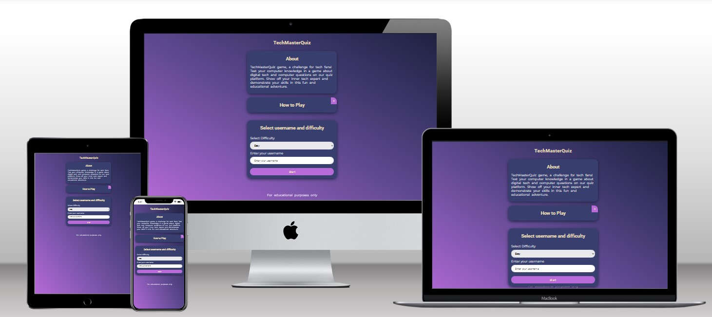
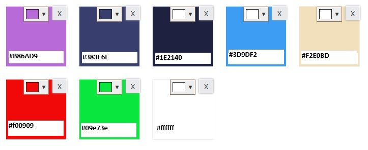

# Welcome to TechMasterQuiz

TechMasterQuiz game, a challenge for tech fans! Test your computer knowledge in a game about digital tech and computer questions on our quiz platform. Demonstrate your skills in this fun and educational adventure.

TechMasterQuiz is designed for individuals eager to test their computer knowledge and for those keen on expanding their understanding of computers.

## Table of Contents

- [UX](#ux "UX")
  - [User Goals](#user-goals "User Goals")
  - [User Stories](#user-stories "User Stories")
  - [Site Owners Goals](#site-owners-goals)
  - [User Requirements and Expectations](#user-requirements-and-expectations)
    - [Requirements](#requirements)
    - [Expectations](#expectations)
  - [Design Choices](#design-choices)
    - [Fonts](#fonts)
    - [Icons](#icons)
    - [Colors](#colors)
    - [Structure](#structure)
- [Wireframes](#wireframes)
  - [Features](#features)
    - [Welcome Page](#welcome-page)
    - [Game Page](#game-page)
    - [Footer](#footer)
    - [Features to be implemented](#features-to-be-implemented)
- [Technologies used](#technologies-used)
  - [Languages](#languages)
  - [Tools](#tools)
- [Testing](#testing)
  - [Unfixed Bugs](#unfixed-bugs)
- [Deployment](#deployment)
- [Refactor](#refactor)
- [Credits](#credits)

## UX

### User Requirements and Expectations

### User Goals

- Test and improve knowledge:
  - Users may aim to test their current knowledge of computer-realted topics.
  - Users may want to improve their understanding of specific areas within the field of technology.
- Compete and Challange:
  - Users might seek the thrill of competition and challenge, trying to achieve high scores or compete against others.
  - Users might want to share their quiz results on social media or challenge their friends to beat their scores.
- Learn in an Engaging Way:
  - Users could be looking for an engaging and interactive way to learn about computers.
- Enjoy a Relaxing Break
  - Some users may use the quiz as a way to take a break and unwind.

[Back to Top](#table-of-contents)

### User Stories

- As a learner, I want to have access to a variety of quizzes covering different topics in technology, so that I can expand my knowledge in specific areas of interest.
- As a quiz enthusiast, I want to easily sign in with my username so that I can track my progress and see personalized content based on my preferences.
- As a user looking for a quick break, I want to be able to start a short quiz without having to go through a lengthy sign-up process, so that I can enjoy a quick and fun diversion.
- As a casual user, I want the quiz platform to have a visually appealing and user-friendly design, so that I can navigate through the questions easily and enjoy a pleasant experience.

[Back to Top](#table-of-contents)

### Site owners Goals

- Increase User Engagement
  - Increase the average time users spend on the platform.
- Boost User Retention:
  - Encourage users to return to the platform regularly.
- Enhance Content Quality:
  - Provide high-quality and diverse quiz content to keep users engaged.

[Back to Top](#table-of-contents)

### Requirements

- User Authentication:
  - Users are asked to insert a username.
- Quiz Creation:
  - The system should allow administrators to create quizzes with multiple-choice questions.
- Mobile Responsiveness:
  - The platform should be accessible and user-friendly on various devices, including desktop and mobile.
- Performance:
  - The system should respond to user interactions quickly, with minimal latency.
- Compatibility:
  - The platform should be compatible with major web browsers to accommodate a wide range of users.

[Back to Top](#table-of-contents)

### Expectations

- User Expectations:
  - Users expect a smooth and intuitive registration process, enabling easy account creation with a unique username.
- Platform Accessibility:
  - Users expect the platform to be accessible on various devices, ensuring a consistent and user-friendly experience, whether on desktop or mobile.
- Engaging Quiz Content:
  - Users look forward to diverse and high-quality quiz content, covering a range of topics within the field of technology.
- Immediate Feedback:
  - Users anticipate immediate feedback on quiz questions, with clear explanations for correct and incorrect answers, enhancing the learning experience.
- Intuitive User Interface:
  - Users anticipate a user-friendly and visually appealing interface that is easy to navigate, contributing to an enjoyable overall experience.
  
[Back to Top](#table-of-contents)

## Design Choices

### Fonts

While choosing the fonts for website I have searched on Google for the best fonts to use in 2023. And so I've integrated [Google Fonts](https://fonts.google.com/ "Google Fonts") to find a typeface that complements the website's aesthetic. For the main text, I've opted for [Montserrat](https://fonts.google.com/specimen/Montserrat?query=mon "Montserrat font"). To distinguish the headers from the rest of the font I have selected [Roboto](https://fonts.google.com/specimen/Roboto?query=mon "Roboto font")

### Icons

As for icons I decided to use for my website [Font Awesome library](https://fontawesome.com/ "Font Awesome").

### Colors

When I selected the colors for the website I had in mind tech and colorfull. So I went on pinterest.com and searched for colorfull projects. I've have selected an image from there. After that, using a collor picker I have manualy created a new set of collors using [Colorcombos](https://www.colorcombos.com/combomaker.html?design=cupcakes&output_width=100&size_option=element&colors=B86AD9,383E6E,1E2140,3D9DF2,F2E0BD,F00909,09E73E,FFFFFF&background_color=FFFFFF&show_hex_flag=Y "colorcombos")

I will explain the uses of the various colors below, starting from top to bottom.

- clr-pink: #b86ad9 - This color will be used for buttons, links, borders, headers and hovers.
- clr-primary: #383e6e - This color will be used for section backgrounds and for body background pallete
- clr-dark: #1e2140 - This collor will be used for body background pallete
- clr-blue: #3d9df2 - This collor will be used for buttons and links
- clr-tan: #f2e0bd - This color will be used for links and Headers
- clr-red: #f00909 - This color will be used to display the wrong answers
- clr-green: #09e73e - This color will be used to display the correct answers
- clr-white: #ffffff - This color will be used for text

### Structure

The website will follow a mobile-first strategy, the main target is to create a visually appealing design for smaller screens. As for the smallest design I chose Samsung Galaxy S8 and iPhone 5. Target resolution is 320px. To ensure responsiveness, if the screen is > than 576px then the content will be displayed on the middle of the page with a width of 500px

[Back to Top](#table-of-contents)

## Wireframes

For wireframing to vissually structuire and play the layout and design of the website I have selected [Balsamic](https://balsamiq.com/wireframes/ "Balsamic"). aiming to provide a user-friendly experience and maintain design consistency across different devices.

The wireframes are below:

### [Desktop Wireframe](wireframes/layout-desktop.png "Desktop wireframe")

### [Tablet Wireframe](wireframes/layout-tablet.png "Tablet wireframe")

### [Phone Wireframe](wireframes/layout-mobile.png "Phone wireframe")

[Back to Top](#table-of-contents)

## Features

### Welcome Page

### Game Page

### Footer

### Features to be Implemented

- **Social Network Login:** Enable users to effortlessly log in and share their scores through social networks.

- **User Highscore:** Introduce a personalized highscore feature for each user, allowing them to track their performance.

- **Global Scoreboard by Categories:** Implement a global scoreboard categorized by different quiz difficulty, providing a competitive element across users.

[Back to Top](#table-of-contents)

## Technologies used

- **HTML**
- **CSS**
- **JS**
- **API**

### Languages

- [HTML](https://en.wikipedia.org/wiki/HTML "HTML")
- [CSS](https://en.wikipedia.org/wiki/CSS "CSS")
- [Javascript](https://en.wikipedia.org/wiki/JavaScript "Javascript")

### Libraries & Frameworks

- [Google Fonts](https://fonts.google.com/ "Google Fonts")
- [Font Awesome library](https://fontawesome.com/ "Font Awesome")

### Tools

- [Balsamic](https://balsamiq.com/wireframes/ "Balsamic")
- [W3C HTML Validation Service](https://validator.w3.org/ "W3C HTML")
- [W3C CSS Validation Service](https://jigsaw.w3.org/css-validator/ "W3C CSS")
- [jshint](https://jshint.com/ "jshint")
- [Colorcombos](https://www.colorcombos.com "colorcombos")
- [CSS Scan](https://getcssscan.com/css-box-shadow-examples "getcssscan.com")

[Back to Top](#table-of-contents)

## Testing

- The website has met the objectives set by all parties involved. It's responsive on various screen sizes, ensuring clean and crisp images without excessive empty space. Users can easily navigate and contact us through the contact form or social media. The content is concise, and the design is uncluttered, providing a user-friendly experience.

- While testing I didn't encounter any errors with the final project.
- HTML (index.html) validator [results](wireframes/html-validate.jpg "W3C HTML")
- CSS validator [results](wireframes/css-validate.jpg "W3C CSS")

- The final project was tested using Google's Lighthouse on github pages. The results are below
- Performance test for Mobile:

- Performance test for Desktop:

- When testing on Google Chrome mobile version I didn't like the default browser theme color so I've customized the browser's theme color to match the website's theme, ensuring that everything looks just the way I prefer it.

`
<meta name="theme-color" content="#1e2140">
`

- Using Mobile Simulator extension in Google Chrome I have tested the website on differite devices. Test results are listed below.

| Device                |     Test 1     |       Test 2 | Result Test 1 | Result Test 2 |
| --------------------- | :------------: | -----------: | ------------- | ------------- |
| Samsung Galaxy S20    | Responsiveness |  Attractions | Passed        | Passed        |
| Samsung Galaxy S21 FE | Responsiveness |  Menu Button | Passed        | Passed        |
| iPad Air 4            | Responsiveness |         Menu | Passed        | Passed        |
| Galaxy Tab S7         | Responsiveness |         Menu | Passed        | Passed        |
| iPhone 5              | Responsiveness |  Menu Button | Passed        | Passed        |
| iPhone X              | Responsiveness |      History | Passed        | Passed        |
| iPhone 11             | Responsiveness |      Cuisine | Passed        | Passed        |
| iPhone 12 Mini        | Responsiveness | Contact Form | Passed        | Passed        |
| iPhone 13 PRO         | Responsiveness |  Menu Button | Passed        | Passed        |
| Mackbook Air          | Responsiveness |         Menu | Passed        | Passed        |
| Desktop               | Responsiveness |    Thank You | Passed        | Passed        |
| Dell Latitude         | Responsiveness |         Menu | Passed        | Passed        |

## Bugs

- There are no bugs to fix in the final project

## Unfixed Bugs

[Back to Top](#table-of-contents)

## Deployment

After writing the code, committing, and pushing it to GitHub, the project was deployed using GitHub by following these steps:

- Go to the repository on GitHub and click on **Settings**
- In the side navigation, select **Pages**
- In the **None** dropdown, choose **main**
- Click the **Save** button.
- The website is now live at `https://USERNAME.github.io/explore-romania/`
- If any changes are needed, you can make them, commit, and push to GitHub, and the updates will be reflected on the website.

[Back to Top](#table-of-contents)

### Refactor

### Credits

[Back to Top](#table-of-contents)
