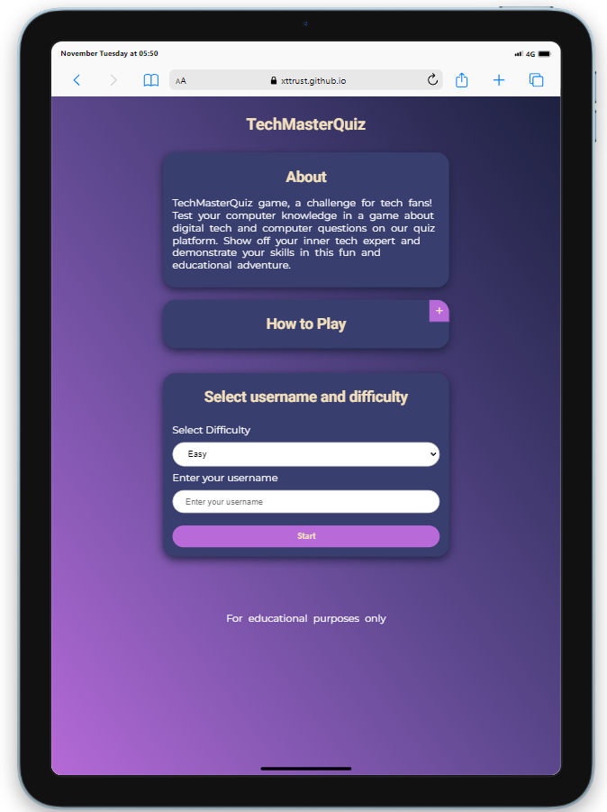

# Welcome to TechMasterQuiz

TechMasterQuiz game, a challenge for tech fans! Test your computer knowledge in a game about digital tech and computer questions on our quiz platform. Demonstrate your skills in this fun and educational adventure.

TechMasterQuiz is designed for individuals eager to test their computer knowledge and for those keen on expanding their understanding of computers.

## Table of Contents

- [UX](#ux "UX")
  - [User Goals](#user-goals "User Goals")
  - [User Stories](#user-stories "User Stories")
  - [Site Owners Goals](#site-owners-goals)
  - [User Requirements and Expectations](#user-requirements-and-expectations)
    - [Requirements](#requirements)
    - [Expectations](#expectations)
  - [Design Choices](#design-choices)
    - [Fonts](#fonts)
    - [Icons](#icons)
    - [Colors](#colors)
    - [Structure](#structure)
- [Wireframes](#wireframes)
  - [Features](#features)
    - [Welcome Page](#welcome-page)
    - [Game Page](#game-page)
    - [Results Page](#results-page)
    - [Footer](#footer)
    - [Features to be implemented](#features-to-be-implemented)
- [Technologies used](#technologies-used)
  - [Languages](#languages)
  - [Tools](#tools)
- [Testing](#testing)
  - [Functionality Tests](#functionality-tests)
  - [Error Handling Tests](#error-handling-tests)
  - [Responsive Design Tests](#responsive-design-tests)
  - [Performance Tests](#performance-tests)
  - [General Tests](#general-tests)
  - [Bugs](#bugs)
  - [Fixed Bugs](#fixed-bugs)
  - [Unfixed Bugs](#unfixed-bugs)
- [Deployment](#deployment)
- [Credits](#credits)

## UX

### User Requirements and Expectations

### User Goals

- Test and improve knowledge:
  - Users may aim to test their current knowledge of computer-realted topics.
  - Users may want to improve their understanding of specific areas within the field of technology.
- Compete and Challange:
  - Users might seek the thrill of competition and challenge, trying to achieve high scores or compete against others.
  - Users might want to share their quiz results on social media or challenge their friends to beat their scores.
- Learn in an Engaging Way:
  - Users could be looking for an engaging and interactive way to learn about computers.
- Enjoy a Relaxing Break
  - Some users may use the quiz as a way to take a break and unwind.

[Back to Top](#table-of-contents)

### User Stories

- As a user, I want to have access to a variety of quizzes covering different topics in technology, so that I can expand my knowledge in specific areas of interest.
- As a user, I want to easily sign in with my username.
- As a user looking for a quick break, I want to be able to start a short quiz without having to go through a lengthy sign-up process, so that I can enjoy a quick and fun diversion.
- As a user, I want the quiz platform to have a visually appealing and user-friendly design, so that I can navigate through the questions easily and enjoy a pleasant experience.

[Back to Top](#table-of-contents)

### Site owners Goals

- Increase User Engagement
  - Increase the average time users spend on the platform.
- Boost User Retention:
  - Encourage users to return to the platform regularly.
- Enhance Content Quality:
  - Provide high-quality and diverse quiz content to keep users engaged.

[Back to Top](#table-of-contents)

### Requirements

- User Authentication:
  - Users are asked to insert a username.
- Quiz Creation:
  - The system should allow administrators to create quizzes with multiple-choice questions.
- Mobile Responsiveness:
  - The platform should be accessible and user-friendly on various devices, including desktop and mobile.
- Performance:
  - The system should respond to user interactions quickly, with minimal latency.
- Compatibility:
  - The platform should be compatible with major web browsers to accommodate a wide range of users.

[Back to Top](#table-of-contents)

### Expectations

- User Expectations:
  - Users expect a smooth and intuitive registration process, enabling easy account creation with a unique username.
- Platform Accessibility:
  - Users expect the platform to be accessible on various devices, ensuring a consistent and user-friendly experience, whether on desktop or mobile.
- Engaging Quiz Content:
  - Users look forward to diverse and high-quality quiz content, covering a range of topics within the field of technology.
- Immediate Feedback:
  - Users anticipate immediate feedback on quiz questions, with clear explanations for correct and incorrect answers, enhancing the learning experience.
- Intuitive User Interface:
  - Users anticipate a user-friendly and visually appealing interface that is easy to navigate, contributing to an enjoyable overall experience.
  
[Back to Top](#table-of-contents)

## Design Choices

### Fonts

While choosing the fonts for website I have searched on Google for the best fonts to use in 2023. And so I've integrated [Google Fonts](https://fonts.google.com/ "Google Fonts") to find a typeface that complements the website's aesthetic. For the main text, I've opted for [Montserrat](https://fonts.google.com/specimen/Montserrat?query=mon "Montserrat font"). To distinguish the headers from the rest of the font I have selected [Roboto](https://fonts.google.com/specimen/Roboto?query=mon "Roboto font")

### Icons

As for icons I decided to use for my website [Font Awesome library](https://fontawesome.com/ "Font Awesome").

### Colors

When I selected the colors for the website I had in mind tech and colorfull. So I went on pinterest.com and searched for colorfull projects. I've have selected an image from there. After that, using a collor picker I have manualy created a new set of collors using [Colorcombos](https://www.colorcombos.com/combomaker.html?design=cupcakes&output_width=100&size_option=element&colors=B86AD9,383E6E,1E2140,3D9DF2,F2E0BD,F00909,09E73E,FFFFFF&background_color=FFFFFF&show_hex_flag=Y "colorcombos")

I will explain the uses of the various colors below, starting from top to bottom.

- clr-pink: #b86ad9 - This color will be used for buttons, links, borders, headers and hovers.
- clr-primary: #383e6e - This color will be used for section backgrounds and for body background pallete
- clr-dark: #1e2140 - This collor will be used for body background pallete
- clr-blue: #3d9df2 - This collor will be used for buttons and links
- clr-tan: #f2e0bd - This color will be used for links and Headers
- clr-red: #f00909 - This color will be used to display the wrong answers
- clr-green: #09e73e - This color will be used to display the correct answers
- clr-white: #ffffff - This color will be used for text

### Structure

The website will follow a mobile-first strategy, the main target is to create a visually appealing design for smaller screens. As for the smallest design I chose Samsung Galaxy S8 and iPhone 5. Target resolution is 320px. To ensure responsiveness, if the screen is > than 576px then the content will be displayed on the middle of the page with a width of 500px

[Back to Top](#table-of-contents)

## Wireframes

Wireframes were created using [Balsamic](https://balsamiq.com/wireframes/ "Balsamic") for visual structuring and layout planning, maintaining design consistency across devices.

The wireframes are below:

### [Desktop Wireframe](wireframes/wireframe-desktop.png "Desktop wireframe")

### [Tablet Wireframe](wireframes/wireframe-tablet.png "Tablet wireframe")

### [Phone Wireframe](wireframes/wireframe-mobile.png "Phone wireframe")

[Back to Top](#table-of-contents)

## Features

### Welcome Page

- The welcome page serves as an introduction to the game, providing essential details about the rules and mechanics. Users have the opportunity to tailor their gaming experience by selecting a preferred difficulty level and entering a unique username. Visual cues in the accompanying pictures offer a step-by-step guide for these customization options.

  Mobile View:

  Tablet View:

  Desktop View:

## Game Page

- The game page offers an engaging quiz experience, presenting a series of questions based on the selected difficulty level. Users are challenged to answer each question correctly. The interface is designed for intuitive navigation, with interactive elements for selecting answers. Visual feedback, such as highlighting correct and incorrect choices, enhances the gaming experience.

 Mobile View:

  Tablet View:

  Desktop View:

## Results Page

- Upon completing the quiz, the results page displays the user's performance. A detailed summary includes the number of correct and incorrect answers. This section congratulates the player on their achievements and encourages further engagement. Users have the option to play again, restarting the quiz for another round of fun and challenge.

 Mobile View:

  Tablet View:

  Desktop View:

### Footer

The footer will be as simple as a text "For educational purposes only".

### Features to be Implemented

- **Social Network Login:** Enable users to effortlessly log in and share their scores through social networks.

- **User Highscore:** Introduce a personalized highscore feature for each user, allowing them to track their performance.

- **Global Scoreboard by Categories:** Implement a global scoreboard categorized by different quiz difficulty, providing a competitive element across users.

[Back to Top](#table-of-contents)

## Technologies used

### Languages

- [HTML](https://en.wikipedia.org/wiki/HTML "HTML")
- [CSS](https://en.wikipedia.org/wiki/CSS "CSS")
- [Javascript](https://en.wikipedia.org/wiki/JavaScript "Javascript")

### Libraries & Frameworks

- [Google Fonts](https://fonts.google.com/ "Google Fonts")
- [Font Awesome library](https://fontawesome.com/ "Font Awesome")

### Tools

- [Balsamic](https://balsamiq.com/wireframes/ "Balsamic")
- [W3C HTML Validation Service](https://validator.w3.org/ "W3C HTML")
- [W3C CSS Validation Service](https://jigsaw.w3.org/css-validator/ "W3C CSS")
- [jshint](https://jshint.com/ "jshint")
- [Colorcombos](https://www.colorcombos.com "colorcombos")
- [CSS Scan](https://getcssscan.com/css-box-shadow-examples "getcssscan.com")
- [opentdb](opentdb.com "opentdb")

[Back to Top](#table-of-contents)

## Testing

- The game website accomplishes its objectives with a user-friendly design that is responsive to different screen sizes. The interface is clean, users can conveniently select their difficulty level, enter their username, and enjoy a smooth gaming experience.

- While testing the game in ``Chrome``, after I press ``Start`` and stopped the internet the game worked perfectly because the data was fetched when the ``Start`` button was pressed.
- While testing the game widouth internet the game will trow an alert that api data was not loaded and the game will restart after 1 second.
- While testing the game, I have found an error where if you start a game and then go back and start the game again fast the api data will not fetch because of the limitations of ``opentdb.com/api`` works, So the game will trow an alert that api data was not loaded and the game will restart after 1 second.

- HTML (index.html) validator [results](wireframes/html-validator.png "W3C HTML")
- CSS validator [results](wireframes/css-validator.png "W3C CSS")
- JSHint [results](wireframes/js-validator.png "JSHint")

### Functionality Tests

| Test Case | Description | Expected Result |
|-----------|-------------|-----------------|
| 1         | Start the game with a valid username and difficulty level. | Game starts, and the first question is displayed. |
| 2         | Start the game with an empty username. | Alert message displays: "Please enter a username." |
| 3         | Answer a question correctly. | Correct answer highlighted, and the next question is displayed. |
| 4         | Answer a question incorrectly. | Incorrect answer highlighted, correct answer highlighted, and the next question is displayed. |
| 5         | Complete the quiz. | Final score message displays with correct and incorrect answer counts. |
| 6         | Click on the "Play Again" button after completing the quiz. | Game restarts, and the first question is displayed. |

### Error Handling Tests

| Test Case | Description | Expected Result |
|-----------|-------------|-----------------|
| 1         | Simulate a fetch API error during game start. | Alert message displays: "Error while loading API data, the game will restart." |
| 2         | Simulate a fetch API error during a question fetch. | Alert message displays: "Error while loading API data, the game will restart." |

### Responsive Design Tests

| Test Case | Description | Expected Result |
|-----------|-------------|-----------------|
| 1         | Test the game on various devices (desktop, tablet, mobile). | Game displays correctly with a user-friendly layout on all devices. |

### Performance Tests

| Test Case | Description | Expected Result |
|-----------|-------------|-----------------|
| 1         | Use Google Lighthouse for performance testing. | High performance scores for mobile and desktop versions. |

### General Tests

| Test Case | Description | Expected Result |
|-----------|-------------|-----------------|
| 1         | Click on the "How to Play" button. | How to play section toggles visibility. |
| 2         | Click on the "How to Play" button multiple times. | How to play section toggles visibility correctly. |
| 3         | Start the game without selecting a difficulty level. | Fetches quiz data with the default difficulty level. |
| 4         | Reset the game after completing it. | Game resets, and the start page is displayed. |
| 5         | Test the game on various browsers. | Game functions correctly on major web browsers. |

- The final project was tested using Google's Lighthouse on github pages. The results are below
- Performance test for Mobile:

- Performance test for Desktop:

- Just to make sure that on  Google Chrome mobile version looks nice I've customized the browser's theme color to match the website's theme.

`
<meta name="theme-color" content="#1e2140">
`

- The game has undergone thorough testing across various platforms, including real devices like the S21 FE, mobile simulators, and desktop environments. This ensures a consistent and enjoyable experience for users, regardless of the device they choose to play on.

## Bugs

## Fixed Bugs

- While creating the game I encountered an issue with the asynchronous behavior of the game. This behavior occurs only the first time a user visits the site and has no browser data saved. I've implemented error handling to catch the issue. In such cases, users will receive an alert notifying them that the API data failed to load.
- After many hours of research and youtube tutorials I have rewriten the code and fixed all errors.

## Unfixed Bugs

- There are no unfixed bugs.

[Back to Top](#table-of-contents)

## Deployment

After writing the code, committing, and pushing it to GitHub, the project was deployed using GitHub by following these steps:

- Go to the repository on GitHub and click on **Settings**
- In the side navigation, select **Pages**
- In the **None** dropdown, choose **main**
- Click the **Save** button.
- The website is now live at `https://USERNAME.github.io/Tech-Master-Quiz/`
- If any changes are needed, you can make them, commit, and push to GitHub, and the updates will be reflected on the website.

[Back to Top](#table-of-contents)

### Credits

For help and advice

- [Simen Daehlin](https://github.com/Eventyret "Simen Daehlin")

For api data

- [opentdb](opentdb.com "opentdb")

For array shuffle

- [stackoverflow.com](https://stackoverflow.com/questions/2450954/how-to-randomize-shuffle-a-javascript-array
 "stackoverflow.com")

For async function:

- [Google.com](https://www.google.com "Google.com")
- [Fetch API - JavaScript Tutorial for beginners](https://www.youtube.com/watch?v=ubw2hdQIl4E&t=1066s "ColorCode")

For CSS

- [Background Gradient](https://mycolor.space/ "mycolor.space")
- [CSS Normalize](https://github.com/necolas/normalize.css "CSS Normalize")

[Back to Top](#table-of-contents)
